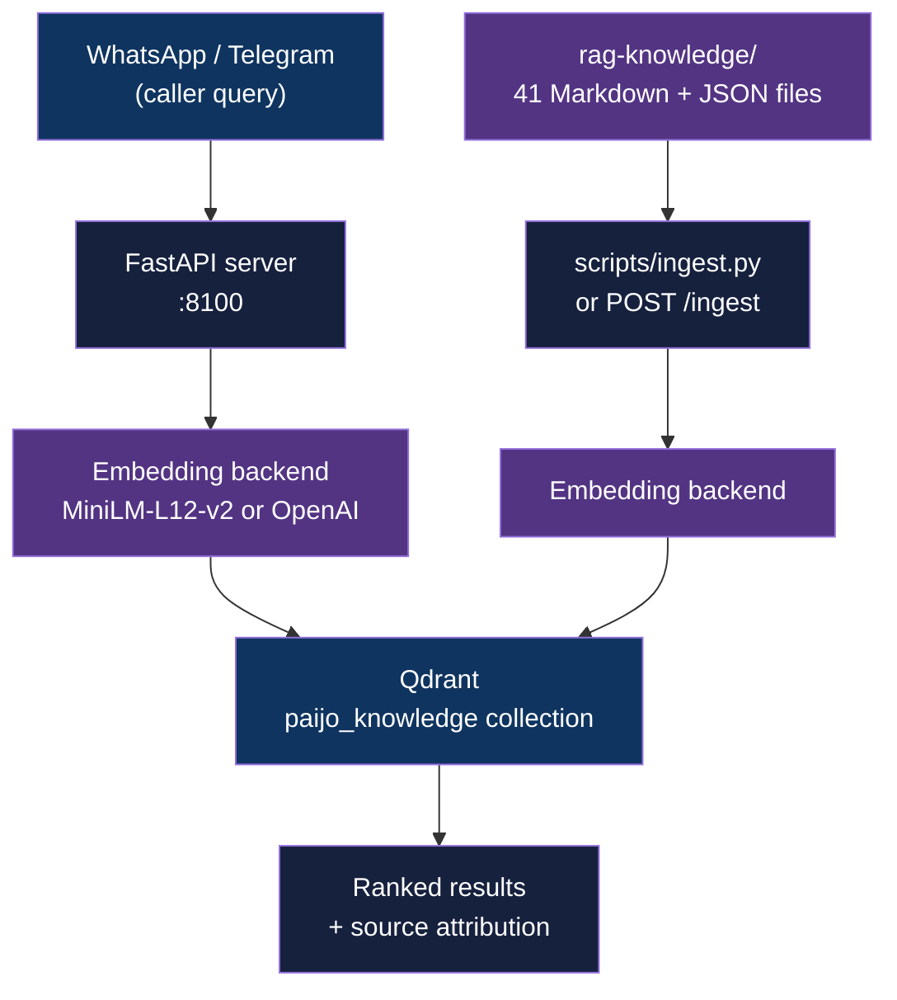

<div align="center">

# pAIjo RAG

[](https://python.org)
[](https://fastapi.tiangolo.com)
[](LICENSE)

**RAG pipeline for an Islamic knowledge assistant - FastAPI, Qdrant, and sentence-transformers grounding for the pAIjo WhatsApp bot**

*Built in collaboration with [Ainun Najib](https://github.com/ainunnajib) as part of the [pAIjo](https://github.com/ainunnajib/pAIjo) WhatsApp Muslim Assistant project*

[Getting Started](#getting-started) | [Usage](#usage) | [API Reference](#api-reference)

</div>

---

## Table of Contents

- [The Problem](#the-problem)
- [Features](#features)
- [Tech Stack](#tech-stack)
- [Architecture](#architecture)
- [Getting Started](#getting-started)
  - [Prerequisites](#prerequisites)
  - [Installation](#installation)
  - [Configuration](#configuration)
- [Usage](#usage)
- [API Reference](#api-reference)
- [Architectural Decisions](#architectural-decisions)
- [Project Structure](#project-structure)
- [Deployment](#deployment)
- [License](#license)
- [Author](#author)

## The Problem

### Fabricated Islamic Knowledge Is a Critical Failure Mode

General-purpose LLMs frequently hallucinate religious content: misattributing hadiths, inverting fiqih rulings, or generating plausible-sounding but unverified fatwa. In Islamic jurisprudence, an incorrect ruling is not a minor error - it can mislead users on obligatory acts of worship and theological questions. For an assistant targeting Indonesian Muslims (WhatsApp has 200M+ users in Indonesia), the stakes are high enough that LLM generation alone is not acceptable.

### The Solution

pAIjo RAG grounds every response in a hand-curated corpus of verified Islamic knowledge. Queries are embedded and matched against Qdrant using cosine similarity, so the bot retrieves source-attributed passages before generating any reply - making hallucination structurally harder.

## Features

- **Dual embedding backend** - defaults to local `paraphrase-multilingual-MiniLM-L12-v2` (384 dims, no API key); switchable to `text-embedding-3-small` (1536 dims) via env var
- **Category-filtered retrieval** - `/retrieve` accepts an optional `category` field (e.g., `ibadah`, `fiqih`) to scope results
- **Score-threshold gating** - results below a configurable cosine-similarity threshold (default 0.2) are dropped before returning to the caller
- **Dual-mode ingestion** - HTTP `POST /ingest` for API-driven pipelines; `scripts/ingest.py` for CLI use without starting the server
- **Word-based chunking with overlap** - 512-word chunks, 50-word overlap, configurable via env vars
- **41-file curated knowledge base** - NU Islamic traditions, Ramadan guidance, fiqih/ibadah JSON, and fatwa references

## Tech Stack

| Component | Technology |
|-----------|------------|
| Language | Python 3.10+ |
| API framework | FastAPI |
| Vector database | Qdrant |
| Embeddings (default) | sentence-transformers `paraphrase-multilingual-MiniLM-L12-v2` (384 dims) |
| Embeddings (optional) | OpenAI `text-embedding-3-small` (1536 dims) |
| Configuration | Pydantic Settings |
| Containerization | Docker + docker-compose |

## Architecture



**Ingestion pipeline** - knowledge files (`rag-knowledge/`) are parsed (JSON/Markdown), chunked into 512-word overlapping segments, embedded, and upserted into Qdrant.

**Query pipeline** - incoming queries are embedded with the same backend, searched against the collection using cosine similarity, filtered by score threshold, and returned with title, source, category, and score metadata.

## Getting Started

### Prerequisites

- Python 3.10+
- Qdrant - via Docker (recommended) or [standalone binary](https://github.com/qdrant/qdrant/releases)

### Installation

1. Clone the repository:
   ```bash
   git clone https://github.com/adityonugrohoid/pAIjo-rag.git
   cd pAIjo-rag
   ```

2. Create and activate a virtual environment:
   ```bash
   python -m venv .venv
   source .venv/bin/activate
   ```

3. Install dependencies:
   ```bash
   pip install -r requirements.txt
   ```

### Configuration

```bash
cp .env.example .env
```

<details>
<summary>Full configuration reference</summary>

```bash
# Qdrant
QDRANT_URL=http://localhost:6333
QDRANT_COLLECTION=paijo_knowledge

# Embedding backend: "local" (default) or "openai"
EMBEDDING_PROVIDER=local
LOCAL_MODEL_NAME=paraphrase-multilingual-MiniLM-L12-v2
OPENAI_API_KEY=

# Retrieval
TOP_K=3
SCORE_THRESHOLD=0.2

# Chunking
KNOWLEDGE_DIR=rag-knowledge
CHUNK_SIZE=512
CHUNK_OVERLAP=50

# Server
HOST=0.0.0.0
PORT=8100
```

</details>

Switching `EMBEDDING_PROVIDER` changes vector dimensions (384 vs 1536). You must drop and recreate the Qdrant collection when switching.

## Usage

Start Qdrant, then start the server:

```bash
# Terminal 1: start Qdrant
docker compose up -d

# Terminal 2: start the API server
uvicorn app.main:app --host 0.0.0.0 --port 8100
```

Ingest the knowledge base and run a test query:

```bash
# Ingest all knowledge files
curl -X POST http://localhost:8100/ingest \
  -H "Content-Type: application/json" -d '{}'

# Retrieve relevant chunks
curl -X POST http://localhost:8100/retrieve \
  -H "Content-Type: application/json" \
  -d '{"query": "apa itu tahlilan?", "top_k": 3}'
```

CLI scripts connect directly to Qdrant without starting the FastAPI server:

```bash
# Ingest
python scripts/ingest.py
python scripts/ingest.py --path rag-knowledge/ramadan-01.md

# Retrieve
python scripts/retrieve.py "apa itu tahlilan?"
python scripts/retrieve.py "shalat tarawih" --category ibadah --top-k 5
python scripts/retrieve.py "zakat fitrah" --json
```

## API Reference

### Endpoints

| Method | Endpoint | Description |
|--------|----------|-------------|
| `GET` | `/healthz` | Health check with collection info |
| `POST` | `/ingest` | Ingest knowledge files into Qdrant |
| `POST` | `/retrieve` | Retrieve ranked knowledge chunks for a query |

### GET /healthz

```bash
curl http://localhost:8100/healthz
```

```json
{
  "status": "ok",
  "collection": "paijo_knowledge",
  "points": 68
}
```

### POST /ingest

```bash
# Ingest all files
curl -X POST http://localhost:8100/ingest \
  -H "Content-Type: application/json" -d '{}'

# Ingest a specific file
curl -X POST http://localhost:8100/ingest \
  -H "Content-Type: application/json" \
  -d '{"path": "rag-knowledge/ramadan-01.md"}'
```

### POST /retrieve

```bash
curl -X POST http://localhost:8100/retrieve \
  -H "Content-Type: application/json" \
  -d '{"query": "Apa itu tahlilan?", "top_k": 3}'
```

```json
{
  "query": "Apa itu tahlilan?",
  "count": 3,
  "results": [
    {
      "text": "Tahlilan adalah tradisi membaca doa...",
      "title": "Tahlilan dan Kirim Doa untuk Mayit",
      "source": "Bahtsul Masail NU",
      "category": "fiqih",
      "score": 0.3042
    }
  ]
}
```

## Architectural Decisions

### 1. Local embedding default with optional OpenAI fallback

**Decision:** `paraphrase-multilingual-MiniLM-L12-v2` is the default embedding model, with `text-embedding-3-small` as an opt-in alternative.

**Reasoning:** The knowledge corpus is Indonesian-Arabic multilingual content. MiniLM-L12-v2 is trained on 50+ languages including Indonesian, runs fully offline with no API cost, and produces 384-dim vectors that fit comfortably in Qdrant on minimal hardware. OpenAI is available for contexts where 1536-dim embeddings improve recall on edge queries, but switching requires recreating the collection since dimensions must be consistent.

### 2. Score threshold on retrieval

**Decision:** Results with cosine similarity below 0.2 are dropped before returning to the caller.

**Reasoning:** For Islamic knowledge, a low-confidence retrieval is worse than no retrieval - the caller (pAIjo bot) should fall back to a safe "I don't have verified information on this" response rather than present weakly-matched content as authoritative. The 0.2 threshold is configurable via `SCORE_THRESHOLD` for tuning per domain.

### 3. Word-based chunking instead of character-based

**Decision:** Chunks split on word boundaries (512 words, 50-word overlap) rather than character count.

**Reasoning:** Islamic text mixes Arabic script, Indonesian prose, and transliteration. Character-based splitting risks cutting mid-word through Arabic terms or transliterated names, which corrupts the semantic unit. Word-boundary chunking preserves term integrity across all three scripts.

## Project Structure

```
pAIjo-rag/
├── app/
│   ├── main.py            # FastAPI app, lifespan, singleton init
│   ├── config.py          # Pydantic Settings (env-driven)
│   ├── models.py          # Request/response Pydantic models
│   ├── state.py           # Module-level singletons (embedding, vectorstore)
│   ├── api/
│   │   └── routes.py      # /healthz, /retrieve, /ingest handlers
│   └── core/
│       ├── parser.py      # JSON/Markdown file parsing
│       ├── chunker.py     # Word-based chunking with overlap
│       ├── embeddings.py  # Dual backend: MiniLM-L12-v2 + OpenAI
│       └── vectorstore.py # Qdrant client wrapper
├── scripts/
│   ├── ingest.py          # CLI ingestion (no server required)
│   └── retrieve.py        # CLI retrieval with category + JSON flags
├── rag-knowledge/         # 41-file curated Islamic knowledge corpus
├── docker-compose.yml     # Qdrant service definition
├── Dockerfile
├── requirements.txt
└── .env.example
```

## Deployment

### Docker (Qdrant only)

```bash
docker compose up -d
```

This starts Qdrant on ports 6333 (HTTP) and 6334 (gRPC) with persistent named volume `qdrant_data`. Run the FastAPI server separately with uvicorn.

### Full containerized stack

```bash
docker build -t paijo-rag .
docker run -p 8100:8100 --env-file .env paijo-rag
```

Qdrant must be reachable at `QDRANT_URL` (default `http://localhost:6333`). In a compose stack, set `QDRANT_URL=http://qdrant:6333` and add the `qdrant` service as a dependency.

## License

This project is licensed under the [MIT License](LICENSE).

## Author

**Adityo Nugroho** ([@adityonugrohoid](https://github.com/adityonugrohoid))
